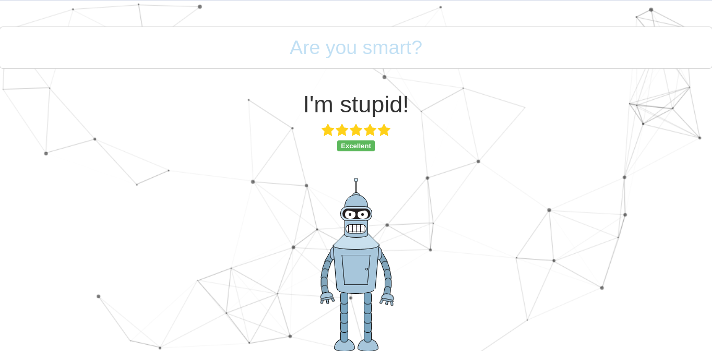

# fake-ai

---

`fake-ai` is a **simulated artificial intelligence** using Twitter replies.

## Story

When I went to high school I had to do a project of my choice on a subject that fascinated me. I liked the smart chat bots but I didn't have the knowledge to create a real one. So I created a fake one.

On the web I had seen a fake chatbot earlier. It put two unknown humans in contact; both believed they were talking to a bot.

So I thought to use the same trick. However, using public conversations that have already taken place (on [Twitter](https://www.twitter.com)) rather than live conversations.

**Fail**: Obviously the idea was a failure because the bot is stupid (it does not distinguish nonsensical phrases from the others, and the internet is full of meaningless phrases) and other reasons. And I never presented it!

**Publication**: I found the whole source code on an old USB and, despite the uselessness of the project, some parts of it could be good.

## Usage

- Download [fake-ai](https://github.com/derogab/fake-ai)
- Create database using [init.sql](./assets/sql/init.sql)
- Connect the database in the [config](./config.php) file

and then 

- [Learn](#learn) new question/reply
- [Chat](#chat) with bot

### Learn
- Insert Twitter Keys in the [config](./config.php) file
    - You can create `CONSUMER_KEY` and `CONSUMER_SECRET` [here](https://apps.twitter.com/)
- Open `/learn` and click the button

### Chat
- Open `/` and ask everything you want